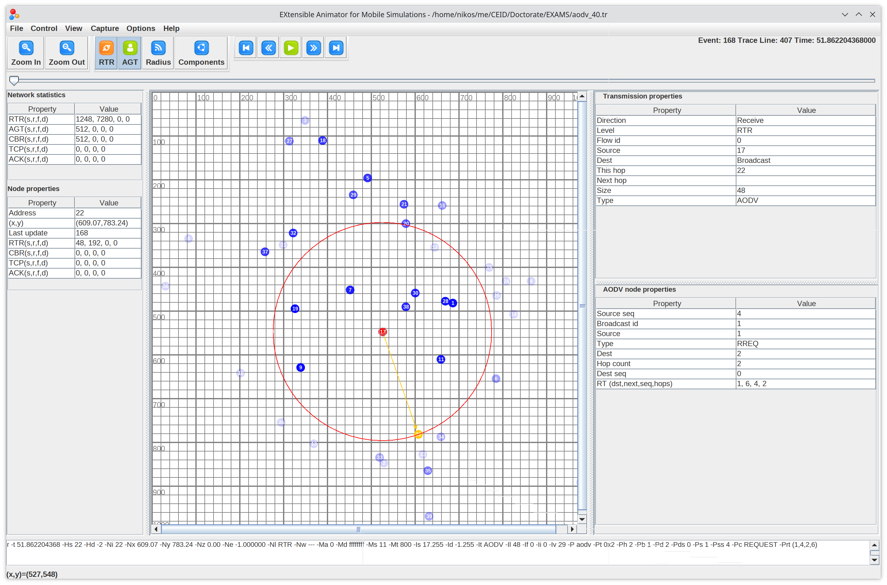

# EXtensible Animator for Mobile Simulations (EXAMS)

EXAMS is a visualization tool for the wireless network simulator [NS-2](https://www.isi.edu/websites/nsnam/ns/).

- Built with the network protocol designer in mind.
- Enable accurate animation of NS-2 simulations with a synchronized visualization of the wireless transmission and the internal data structures stored in each node.
- Modular architecture allows custom protocol visualisations implemented as extensions to the main tool.
- Provide the environment to study, test and debug wireless networks.


## Screenshots




## References

ArXiV paper: [Extensible Animator for Mobile Simulations: EXAMS](https://arxiv.org/abs/0902.4527v1)

```
@inproceedings{DBLP:conf/mascots/Nikolaos09,
  author    = {Livathinos S. Nikolaos},
  title     = {EXtensible animator for mobile simulations: {EXAMS}},
  booktitle = {17th Annual Meeting of the {IEEE/ACM} International Symposium on Modelling,
               Analysis and Simulation of Computer and Telecommunication Systems,
               {MASCOTS} 2009, September 21-23, 2009, South Kensington Campus, Imperial
               College, London, {UK}},
  pages     = {1--3},
  publisher = {{IEEE} Computer Society},
  year      = {2009},
  url       = {https://doi.org/10.1109/MASCOT.2009.5366277},
  doi       = {10.1109/MASCOT.2009.5366277},
  timestamp = {Wed, 16 Oct 2019 14:14:53 +0200},
  biburl    = {https://dblp.org/rec/conf/mascots/Nikolaos09.bib},
  bibsource = {dblp computer science bibliography, https://dblp.org}
}
```